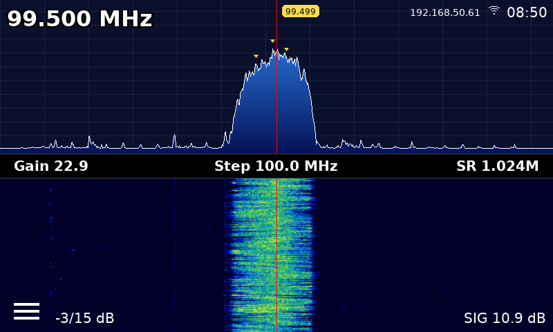

FreqShow 2026 is a custom Raspberry Pi SDR interface built around an 800x480 touchscreen, rotary encoders, and an RTL-SDR. It combines a live spectrum view, waterfall, touch-friendly controls, band limiting, scan tools, and a cleaner appliance-style interface for day-to-day radio monitoring.

Credit to original to Tony DiCola & Carter Nelson & Adafruit
## Highlights

- Live spectrum and waterfall display
- 800x480 touchscreen-optimized layout
- Rotary encoder tuning and control
- Touch tuning on the spectrum
- Favorites and repeater browsing
- Band limit menu with lock indicator
- Scan mode with on-screen badge
- Peak markers with adjustable count
- Smoothed peak-frequency label
- Brightness control
- Wi-Fi icon, local IP display, and clock
- Desktop autostart support

## Screenshots

### Main Display


## What This Build Focuses On

This version is aimed at making FreqShow feel more like a dedicated handheld or bench radio display instead of a desktop SDR program. The interface has been tuned for fast access to common controls, better readability on the larger screen, and smoother real-world use with physical inputs.

## Hardware

Typical hardware for this build:

- Raspberry Pi
- RTL-SDR
- 800x480 display
- Rotary encoders with push switches
- Raspberry Pi OS desktop with auto-login

## Controls

### Main Screen
- **ENC1 rotate**: tune frequency
- **ENC1 press**: cycle tune step
- **ENC1 long press**: save current frequency to favorites
- **ENC2 rotate**: adjust gain
- **ENC2 long press**: toggle scan
- **Touch spectrum**: tune to the tapped frequency
- **Hamburger menu**: open settings

### Settings and Menus
- **ENC1 rotate**: move selection
- **ENC1 press**: open or select
- **ENC2 rotate**: change inline values
- **ENC2 press**: apply, back out, or exit depending on context

## Interface Notes

This build includes a number of usability improvements over earlier versions:

- Larger-screen layout tuned for 800x480
- Improved keypad sizing
- Scrollable menus and submenus
- Blue fill under the spectrum trace
- White spectrum line
- Yellow peak marker and peak label
- Elastic smoothing for peak-frequency readout
- Cleaner top bar with clock, IP, Wi-Fi, and scan state
- Working restart flow from Settings

## Repository Layout

- `freqshow.py` — main application logic
- `display.py` — rendering and UI helpers
- `sdr_backend.py` — SDR initialization and data handling
- `screenshots/` — images used in the README
- `backups/` — local backup copies excluded from Git

## Running

Typical manual launch:

```bash
source ~/FreqShow-venv/bin/activate
DISPLAY=:0 python3 ~/FreqShow/freqshow.py
```

## Autostart

This project is configured to launch after desktop login using an autostart entry in:

```text
~/.config/autostart/
```

## Future Ideas

Planned or possible future additions include:

- scan indicator / hold indicator improvements
- scan limits in settings
- direct frequency entry from the main screen
- band jump menu
- preset step sizes by band
- better scan stop behavior
- save current frequency to favorites from the main screen
- rename favorites on-device
- additional compact status badges
- screenshot / capture CSV
- touch-and-drag fine tune
- auto-hide weak visual clutter
- theme / night mode
- channel info popup
- CW translate
- Wi-Fi on/off toggle in settings

## Notes

This repository reflects a heavily customized personal build developed directly on the device. It is functional and actively improved, though some areas may still benefit from future cleanup and refactoring.

## License

Personal project / custom build.
